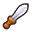
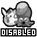
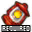
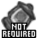
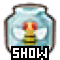

# Z17 Randomizer Tracker

## About

This is an [EmoTracker](https://emotracker.net/) pack for tracking progress in The Legend of Zelda: A Link Between
Worlds Randomizer.

## Release Notes

- Author: LemonKong

Version 3.2.0

- Added support for Randomized Dungeon Prizes
- Swordless Mode support (right-click the Sword)
- Bee Boost Glitches are now hidden by default
- Logic updated to match v0.2.0 of the randomizer
- README has been expanded

Version 3.1.0

- Dungeon checks on the World map are now linked to checks in the Dungeon tabs
- Layout tweaks based on feedback
- Lamp Required/Not Required setting

Version 3.0.0

- Changes to support Z17 Randomizer v0.1.0
- Support for Yuga Seeds
- Support for new logic modes
- New Layout
- Simplified game Settings/Options

Version 2.0.0

- Updated to support the new Z17 Randomizer
- Layout Changes:
    - Removed Ravio/Signs, Shady Guy, Big Bomb Flower, and both Triforces
    - Moved Bracelet, Smooth Gem, and Bow of Light to new spots
    - Design tweaked to accommodate changes
- Logic Updates:
    - Ravio's Shop is open by default
    - Shady Guy Trigger is triggered by default
    - Portals to Lorule are open by default
    - Bombs are no longer required to collect Maiamai
        - New Logic added for cases when you do not have Bombs
    - Lorule Blacksmith now requires Hyrule Blacksmith check cleared first
    - Shady Guy check can be obtained with Pegasus Boots
    - Fix errors in Bee Boost logic I doubt anyone noticed
- Remove several legacy game options no longer relevant to the randomizer

Version 1.1.3

- Fix Cucco Minigame check to no longer require Ravio's shop
- UI Changes:
    - Split several overworld checks with multiple sub-checks into separate checks.
        - This may change in the future based on feedback.
    - Dungeon Rewards have slightly larger icons on the maps now
        - These will now show as Blue if the dungeon can be entered (beyond the lobby)
- Change to "Crossing Dark Room Lampless" logic:
    - All checks in dark rooms now show as Yellow without Lamp by default
    - Enabling "Cross Dark Rooms Lampless" will now switch those checks to Green
- Lorule Castle logic has been expanded:
    - Go Mode items aren't explicitly required anymore if you have the Sages or ToC
    - Remember you need Sword (or Net with "Net as a Weapon" enabled) to play Tennis with Yuganon

Version 1.1.2

- Add sequence breaks to get Eastern Ruins Pegs check with an Enemy Clip from a Tektite

Version 1.1.1

- Change Pendant of Courage to a progressive item with the Charm as its first stage to alleviate confusion for people
  playing on Standard Mode.
- Add new Modify Glitch Logic option "Use Crows to Escape Locations"
- Expand Bee Boost logic into all ledge boosting locations, but only if player doesn't have Bee Badge
- Shield Rod Clipping now requires sword
- Fix Desert Maiamai showing as obtainable before having Merge and access to Lorule

Version 1.1.0

- UI Changes:
    - Add a purple outline around the Lorule icon to make it easier to see when it's been obtained
    - Split Options Menu into two sections: "Game Options" and "Modify Glitch Logic" for ease of use
    - Remove custom rental images in Ravio's Shop to reduce visual clutter (Sold Out signs are still kept)
    - Change Side-By-Side tab icon
    - Rename a few checks for clarity
- Logic Adjustments:
    - Add sequence breaks for Dash Dungeon with Nice Bow or Nice Ice Rod
    - Add sequence breaks to get past the Pegs north of Kakariko using the Hookshot or an enemy clip
    - Add new Modify Glitch Logic option "Vulture Boosting"
- Overload item codes with many human-friendly options for use with EmoTracker's ChatHUD system
- Made some revisions to the README

Version 1.0.3

- Add sequence break for Dash Dungeon with Sword Beams

Version 1.0.2

- Add logic to consider new Dash Dungeon strategies with just Bombs or Boomerang
- Remove Dropshadow from broadcast tracker icons
- Adjust floor icons in Swamp and Lorule Castle
- Rearrange directory structure slightly to ease building dev artifacts

Version 1.0.1

- Removed explicit background color from broadcast view.

Version 1.0.0

- Official release. Updated README.

Version 0.0.1

- Initial Beta release. Moved to new repo.

## Usage Guide

### Dungeon Prize Explanation

| Prize                                                    | Description                                                                                                                                                        |
|----------------------------------------------------------|--------------------------------------------------------------------------------------------------------------------------------------------------------------------|
|                     | **Sage (generic)**  This is a stand-in for the six Sages that don't unlock anything by themselves.                                                       |
|             | **Sage Osfala**  A Sage that also gives an item, causes the Masked Thief Girl to appear in her cave, and unlocks the Sand Rod slot item in Ravio's Shop. |
|             | **Sage Gulley**  A Sage that when collected causes the Dark Maze guards to disappear, making two checks available without Merge in certain modes.        |
|                     | **Pendant (generic)**  This is a stand-in for the Red/Blue Pendants that don't unlock anything by themselves.                                            |
|  | **Pendant of Courage**  A Pendant that also unlocks the Haunted Grove Tree Stump, Irene, and Rosso's House.                                              |

### Location Color Codes

This tracker follows EmoTracker's standard color scheme for its locations:

| Color               | Description                                                                                                                                                                                                                                       |
|---------------------|---------------------------------------------------------------------------------------------------------------------------------------------------------------------------------------------------------------------------------------------------|
| `🟩 Normal`         | All sections of this location are reachable with the current equipment and logic settings.                                                                                                                                                        |
| `🟨 Sequence Break` | All sections of this location are reachable with the current equipment, but at least one section requires a glitch or trick that is outside the current logic settings.                                                                           |
| `🟦 Inspect`        | The sections of this location are not reachable with the current equipment, but the items they contain can be seen or otherwise discerned.                                                                                                        |
| `🟧 Partial`        | This location contains a combination of sections, consisting of either: <li>Reachable sections (`🟩 Normal`, `🟨 Sequence Break`) and unreachable sections (`🟦 Inspect`, `🟥 None`)</li><li>`🟦 Inspect` sections and `🟥 None` sections</li> |
| `🟥 None`           | No sections of this location are reachable by any means with the current equipment.                                                                                                                                                               |
| `⬛ Cleared`         | This location and all of its sections have been marked as cleared by the user.                                                                                                                                                                    |

- Be aware that `🟨 Sequence Break` locations may contain fully reachable `🟩 Normal` sections inside them.
- Currently, the `🟦 Inspect` locations are of limited value as the randomizer does not replace most freestanding models
  yet.
- The `🟥 None` and `⬛ Cleared` locations are only visible if `Show All Locations` is enabled (toggle this with `F11`).

#### Color Blind Support

- EmoTracker supports customizing the above location colors,
  see [the guide on the official EmoTracker Discord](https://discord.com/channels/386961931988369418/422107004560080896/456932364002525185)
  .

### Logic Modes

The randomizer supports five* Logic Modes, and so does this tracker. You can select the mode matching your seed in the
settings panel in the bottom left of the tracker.

| Mode                                                  | Description                                                                                                                                                                                                        |
|-------------------------------------------------------|--------------------------------------------------------------------------------------------------------------------------------------------------------------------------------------------------------------------|
|      | **Normal**  Standard gameplay, no tricky item use or glitches.                                                                                                                                           |
|                   | **Hard**  Adds tricks that aren't technically glitches. Lamp + Net considered as weapons. No glitches.                                                                                                   |
|        | **Glitched (Basic)**  Includes the above plus "basic", easy-to-learn glitches.                                                                                                                           |
|  | **Glitched (Advanced)**  Includes the above plus "advanced" glitches that may be a challenge to master.                                                                                                  |
|          | **Glitched (Hell)**  Includes every known RTA-viable glitch, including the insane ones. Note that the Bee Badge is omitted from the item pool in this mode, to preserve the infamous Bee Boosting trick. |

Raising the Logic Mode to higher difficulties will cause `🟨 Sequence Break` sections to become `🟩 Normal` as they
enter logic.

(*) A sixth Logic Mode, **No Logic**, is also available in the randomizer. Players wishing to tracker their progress
while playing without logic should select the **Glitched (Hell)** Logic Mode, which already maximally describes
available checks.

### Swordless Mode

Right-click the base Sword item to tell the tracker you're playing in Swordless Mode, which slightly changes the logic:

- The Barrier around Hyrule Castle will be removed, allowing access without the Master Sword.
- Zelda and the Triforce will require the Net to access, even on the Normal Logic Mode.

### Minigames

You can tell the tracker whether you've Enabled or Disabled Minigames down in the Settings panel. Disabling Minigames
will hide their checks on the tracker.

The following checks are hidden when Minigames are Disabled:

- Cucco Minigame
- Hyrule Hotfoot
- Octoball Derby
- Rupee Rush (Hyrule)
- Rupee Rush (Lorule)
- Treacherous Tower

Note that the 2 Maiamai located inside the Rupee Rush minigames will not be hidden.

### Lorule Castle Trials

This setting tells the tracker whether the option to skip the Lorule Castle Trials was selected in the randomizer. This
setting slightly alters the logic needed to reach the Final Boss fight, as the player won't need to complete the trials.

### Lamp Requirement

This setting determines whether the logic considers the Lamp as a necessary item to cross dark rooms.

If the Lamp is `Required`, then checks the player would be able to obtain if they crossed a dark room with no light
source will appear as `🟨 Sequence Breaks`. This is because the `Required` setting puts them out of logic, but they are
still technically obtainable as the Lamp is not a hard requirement.

Similarly, if the Lamp is `Not Required`, then those same checks will appear `🟩 Normal`, as the `Not Required` setting
places them in logic, and the seed may require the player to cross a dark room with no light source.

### Display Bee Boost Glitches

Turn this setting on to show `🟨 Sequence Break` checks that require using the Bee Boost glitch.

Checks requiring the Bee Boost glitch are hidden by default given the trick's extreme terribleness.

<u>**Note**</u>: This setting will be ignored if the **Glitched (Hell)** Logic Mode is selected, as they would then be in
logic.

### Maiamai Map

This setting toggles the visibility of the Maiamai checks.

### Hot Keys

Take a minute to review these, you can use them in ANY EmoTracker package.

| Hot Key                   | Action                    | Notes                                                                                                                                  |
|---------------------------|---------------------------|----------------------------------------------------------------------------------------------------------------------------------------|
| F1                        | Package Documentation     | Opens this webpage                                                                                                                     |
| F2                        | Opens the Broadcast View  |                                                                                                                                        |
| F5                        | Reload                    |                                                                                                                                        |
| F11                       | Shows/Hides all Locations | Extremely useful                                                                                                                       |
| Ctrl + O                  | Open                      |                                                                                                                                        |
| Ctrl + S                  | Save                      |                                                                                                                                        |
| Ctrl + Shift + S          | Save As...                |                                                                                                                                        |
| Ctrl + Mousewheel Up/Down | Scale Layout              | Use this to enlarge Dungeon Maps if the defaults are too small.  You have to hover the mouse over the Items section for it to work. |
| Ctrl + 0 (zero)           | Reset Layout Scale        | Undoes any zoom changes                                                                                                                |
| Ctrl + Z                  | Undo                      |                                                                                                                                        |

## License

This program is licensed under the GNU General Public License v2.0.